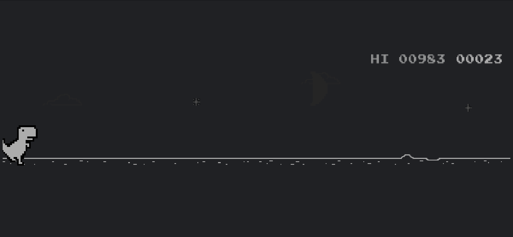

# automated-dino
Dino game automation code written in Python for IEEE Computer Society registrations

## How to Play

1. create a virtual environment `python -m venv .venv` and activate it
2. install the required packages `pip install -r requirements.txt`
3. go to `chrome://dino` (only works with chrome browsers)
4. traverse to the main directory and run `python main.py`
5. switch to the `chrome://dino` tab and start the game

This is a very base level dino automation and it does not work forever.

## demo

